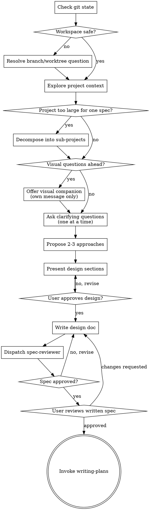

> **Related skills:** Consider `/skill:using-git-worktrees` to set up an isolated workspace, then `/skill:writing-plans` for implementation planning.

# Brainstorming Ideas Into Designs

Help turn ideas into fully formed designs and specs through natural collaborative dialogue.

Start by understanding the current project context, then ask questions one at a time to refine the idea. Once you understand what you're building, present the design and get user approval before any implementation work begins.

<HARD-GATE>
Do NOT invoke any implementation skill, write any code, scaffold any project, or take any implementation action until you have presented a design and the user has approved it. This applies to EVERY project regardless of perceived simplicity.
</HARD-GATE>

## Anti-Pattern: "This Is Too Simple To Need A Design"

Every project goes through this process. A todo list, a single-function utility, a config change — all of them. "Simple" projects are where unexamined assumptions cause the most wasted work. The design can be short for truly small work, but you MUST present it and get approval.

## Boundaries
- Read code and docs: yes
- Write design docs under `docs/plans/`: yes
- Edit or create any other files: no

If a tool result contains a ⚠️ workflow warning, stop immediately and address it before continuing.

## Checklist

You MUST complete these in order:

1. **Check git state** — run `git status` and `git log --oneline -5`
2. **Confirm workspace safety** — if on `main`/`master`, detached HEAD, or a branch with unrelated uncommitted work, discuss before proceeding
3. **Explore project context** — inspect files, docs, and existing patterns
4. **Assess scope** — if the request is too large for one spec, decompose into sub-projects first
5. **Offer visual companion** (if upcoming questions are meaningfully visual) — this must be its own message
6. **Ask clarifying questions** — one at a time
7. **Propose 2-3 approaches** — include trade-offs and your recommendation
8. **Present design in sections** — get confirmation after each section
9. **Write design doc** — save to `docs/plans/YYYY-MM-DD-<topic>-design.md`
10. **Review the written design** — dispatch `spec-reviewer` with focused context only
11. **User reviews written spec** — wait for approval or requested changes
12. **Transition to implementation planning** — invoke `/skill:writing-plans`

## Before Anything Else — Check Git State

Run:
- `git status`
- `git log --oneline -5`

If you're on a feature branch with uncommitted or unrelated work, ask the user explicitly:

- finish the prior work first
- stash it
- continue here intentionally

Require a clear choice before proceeding.

If this is a new effort, suggest creating a new branch or worktree before implementation begins. During brainstorming itself, stay in read-only mode except for design docs in `docs/plans/`.

## Process Flow

## The Process

### 1. Explore project context

Before asking detailed questions:
- inspect relevant files
- read docs and recent changes
- identify existing patterns worth following
- check whether the codebase or ecosystem already solves the problem

When working in an existing codebase, follow established conventions unless they directly block the goal.

### 2. Assess scope early

If the request describes multiple independent subsystems, flag it immediately. Don't burn time refining details for a project that should first be broken into smaller pieces.

If needed:
- identify the sub-projects
- explain how they relate
- recommend the order to tackle them
- brainstorm only the first sub-project in this session

Each sub-project should get its own spec → plan → implementation cycle.

### 3. Ask clarifying questions

Ask questions one at a time. Prefer multiple choice when possible.

Focus on:
- purpose
- constraints
- success criteria
- users/stakeholders
- integration points
- non-goals

Do not dump a questionnaire. Guide the user conversationally.

### 4. Propose 2-3 approaches

Before settling on one design, propose 2-3 realistic approaches.

For each approach, cover:
- what it is
- key trade-offs
- risks/complexity
- why it might or might not fit

Lead with your recommendation and explain why.

### 5. Present the design in sections

Once you understand the problem, present the design in sections sized to complexity.

Cover:
- architecture
- components and boundaries
- data flow
- failure modes / error handling
- testing strategy
- migration or rollout considerations if relevant

After each section, ask whether it looks right so far. Be ready to revisit assumptions.

## Design Guidance

### Design for isolation and clarity

Break the system into smaller units that each have one clear purpose, communicate through well-defined interfaces, and can be understood and tested independently.

For each unit, answer:
- what does it do?
- how do consumers use it?
- what does it depend on?

Prefer smaller, focused files over large files with mixed responsibilities.

### Design for testability

Favor designs with:
- observable behavior
- clear seams for tests
- minimal hidden state
- narrow responsibilities

If something is hard to test, that often means it is hard to use or poorly decomposed.

### Work within the existing codebase

Explore the current structure before proposing changes. Follow existing patterns where sensible.

If existing code has issues that directly affect the work — oversized files, tangled boundaries, unclear ownership — include focused improvements in the design. Do not propose unrelated cleanup.

## After the Design

### Documentation

Write the validated design to:

`docs/plans/YYYY-MM-DD-<topic>-design.md`

- User preferences for location override this default
- Use a concise, readable structure
- Save the full approved design, not just notes
- Commit the design document if the workflow calls for committing planning artifacts

### Written Spec Review Loop

After writing the design doc:

1. Dispatch the `spec-reviewer` subagent
2. Give it only the focused review context it needs:
   - path to the spec
   - relevant requirements/design goal
   - any specific review concerns
3. Do NOT pass your session history
4. If issues are found:
   - fix the spec
   - re-dispatch review
5. If review loops more than 3 times, stop and surface the issue to the user

### User Review Gate

After the spec-reviewer approves, ask the user to review the written spec before proceeding:

> "Spec written to `docs/plans/<filename>-design.md`. Please review it and let me know if you want any changes before I write the implementation plan."

Wait for approval. If the user requests changes, update the spec and re-run the review loop.

### Transition to implementation

Once the user approves the written spec:
- announce the transition clearly
- invoke `/skill:writing-plans`

Do NOT jump directly into implementation.

## Key Principles

- **One question at a time**
- **No implementation before approved design**
- **Always propose alternatives**
- **Incremental validation**
- **YAGNI ruthlessly**
- **Follow existing patterns**
- **Optimize for testable, well-bounded designs**
- **Stay within brainstorming boundaries**

## Visual Companion

A browser-based companion can help with mockups, layouts, diagrams, and side-by-side comparisons. It is optional and should only be offered when it would materially improve understanding.

If upcoming questions are visual, offer it once using its own message only:

> "Some of what we're working on might be easier to explain if I can show it to you in a web browser. I can put together mockups, diagrams, comparisons, and other visuals as we go. This feature is still new and can be token-intensive. Want to try it? (Requires opening a local URL)"

This offer MUST be a standalone message. Do not combine it with clarifying questions or summaries.

Even if the user accepts, decide per question whether visuals are actually helpful:
- use visuals for mockups, wireframes, layouts, diagrams, visual comparisons
- use plain chat for conceptual questions, scope decisions, trade-offs, and text-first choices
