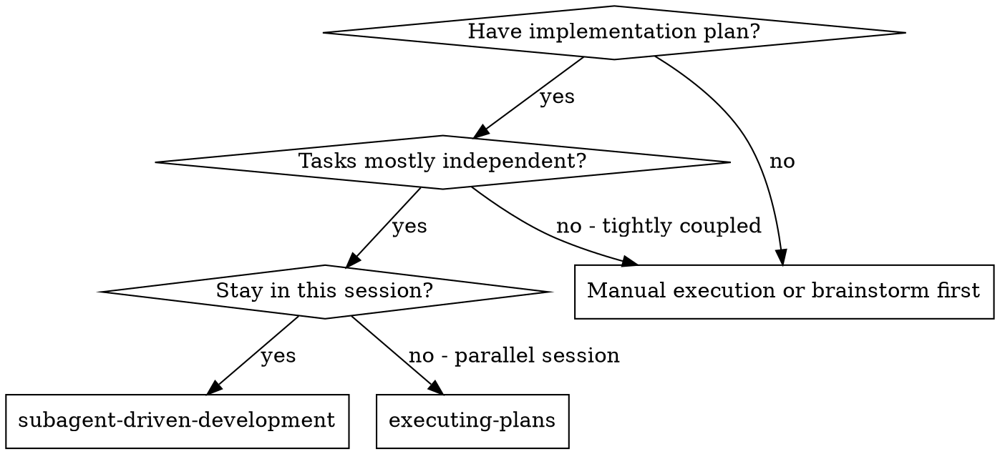
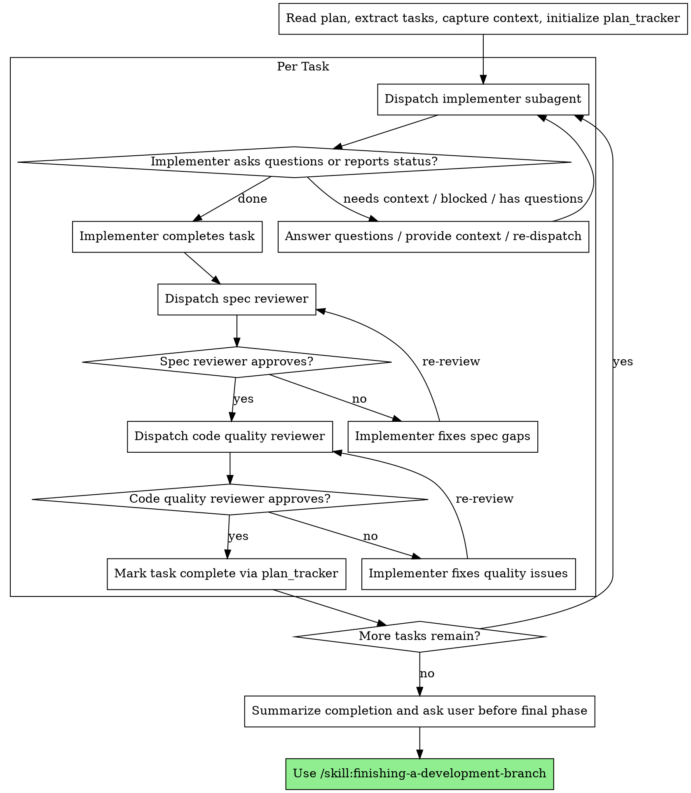

> **Related skills:** Need an isolated workspace? `/skill:using-git-worktrees`. Need a plan first? `/skill:writing-plans`. Done? `/skill:finishing-a-development-branch`.

# Subagent-Driven Development

Execute a plan by dispatching a fresh subagent per task, with two-stage review after each task: spec compliance review first, then code quality review.

**Why subagents:** You delegate tasks to specialized agents with isolated context. By precisely crafting their instructions and context, you keep them focused and effective. They should never inherit your full session history — you construct exactly what they need. This preserves your own context for orchestration and review.

**Core principle:** Fresh subagent per task + two-stage review (spec then quality) = high quality, fast iteration.

If a tool result contains a ⚠️ workflow warning, stop immediately and address it before continuing.

## Prerequisites
- Active branch (not main/master) or user-confirmed intent to work on main
- Approved plan or clear task scope
- Ability to dispatch the required subagents

## When to Use



**Use this when:**
- you already have a written implementation plan
- tasks are mostly independent or only moderately coupled
- you want to stay in the current session
- you want review after each task without stopping for a human checkpoint every time

**Prefer `/skill:executing-plans` when:**
- tasks are tightly coupled
- you want stronger human review between batches
- the work needs more in-session orchestration than isolated execution

**Dependent tasks:** Most real plans have some dependencies. For dependent tasks, include the previous task's implementation summary, files changed, and any important decisions in the next subagent's context. Track what each completed task produced so you can pass it forward.

## Model Selection

Use the least powerful model that can reliably handle each role.

- **Mechanical implementation tasks** (isolated functions, clear specs, 1-2 files): prefer a fast, cheap model
- **Integration and judgment tasks** (multi-file coordination, debugging, pattern matching): use a standard model
- **Architecture or review tasks**: use the most capable available model

**Complexity signals:**
- Touches 1-2 files with a complete spec → cheap model
- Touches multiple files with integration concerns → standard model
- Requires design judgment or broad codebase understanding → most capable model

## The Process



## Handling Implementer Status

Implementer subagents may report one of four statuses. Handle each explicitly:

**DONE**
- The task is complete
- Proceed to spec compliance review

**DONE_WITH_CONCERNS**
- The task is complete, but the implementer flagged concerns
- Read the concerns before proceeding
- If the concerns affect correctness or scope, resolve them before review
- If they are observations (for example, a file is getting too large), note them and continue to review

**NEEDS_CONTEXT**
- The implementer is missing information
- Provide the missing context and re-dispatch
- Do not proceed until the ambiguity is resolved

**BLOCKED**
- The implementer cannot complete the task as specified
- Assess the blocker:
  1. If it is a context problem, provide more context and re-dispatch
  2. If the task needs more reasoning, re-dispatch with a stronger model
  3. If the task is too large, break it into smaller pieces
  4. If the plan is wrong, stop and escalate to the user

Never ignore an escalation or keep retrying the same setup without changing anything.

## Prompt Templates

Use the templates in this directory:
- `./implementer-prompt.md` — implementer subagent
- `./spec-reviewer-prompt.md` — spec compliance reviewer
- `./code-quality-reviewer-prompt.md` — code quality reviewer

**How to dispatch:**

Use the `subagent` tool directly with filled prompt text:

```ts
subagent({ agent: "implementer", task: "... full implementer prompt text ..." })
```

```ts
subagent({ agent: "spec-reviewer", task: "... full review prompt text ..." })
```

```ts
subagent({ agent: "code-reviewer", task: "... full review prompt text ..." })
```

## Orchestrator Rules

- Read the plan once and extract all tasks before starting
- Initialize `plan_tracker` with the full task list
- Provide each subagent the exact task text plus only the context it needs
- Do not make subagents read the entire plan file if you can provide the relevant task directly
- Track outputs from completed tasks so later tasks receive the right context
- Do not skip either review stage
- Do not move to the next task while review issues remain open

## Example Workflow

```
You: I'm using Subagent-Driven Development to execute this plan.

[Read plan file once: docs/plans/feature-plan.md]
[Extract all 5 tasks with full text and context]
[Initialize plan_tracker tool with all tasks]

Task 1: Hook installation script

[Get Task 1 text and context]
[Dispatch implementation subagent with full task text + context]

Implementer: "Before I begin - should the hook be installed at user or system level?"

You: "User level (~/.config/superpowers/hooks/)"

Implementer: "Got it. Implementing now..."
[Later] Implementer:
  - Status: DONE
  - Implemented install-hook command
  - Added tests, 5/5 passing
  - Self-review: Found I missed --force flag, added it
  - Committed

[Dispatch spec compliance reviewer]
Spec reviewer: ✅ Spec compliant - all requirements met, nothing extra

[Dispatch code quality reviewer]
Code reviewer: Strengths: Good test coverage, clean. Issues: None. Approved.

[Mark Task 1 complete]

Task 2: Recovery modes

[Dispatch implementation subagent with full task text + context]

Implementer:
  - Status: DONE_WITH_CONCERNS
  - Added verify/repair modes
  - 8/8 tests passing
  - Concern: progress reporting may need a constant

[Dispatch spec compliance reviewer]
Spec reviewer: ❌ Issues:
  - Missing: Progress reporting (spec says "report every 100 items")
  - Extra: Added --json flag (not requested)

[Implementer fixes issues]
[Spec reviewer reviews again]
Spec reviewer: ✅ Spec compliant now

[Dispatch code quality reviewer]
Code reviewer: Strengths: Solid. Issues (Important): Magic number (100)

[Implementer fixes]
[Code reviewer reviews again]
Code reviewer: ✅ Approved

[Mark Task 2 complete]
```

## Red Flags

**Never:**
- Start implementation on main/master branch without explicit user consent
- Skip reviews (spec compliance OR code quality)
- Proceed with unfixed issues
- Dispatch multiple implementation subagents in parallel against the same changing codebase
- Make a subagent read the full plan when you can provide the relevant task directly
- Skip scene-setting context
- Ignore subagent questions
- Accept "close enough" on spec compliance
- Start code quality review before spec compliance is ✅
- Move to next task while either review has open issues
- Write code yourself to rescue a failed implementer task unless the workflow has explicitly changed

## When a Subagent Fails

You are the orchestrator. You do NOT write code as a shortcut around the process.

If an implementer subagent fails, errors out, or produces incomplete work:

1. **Attempt 1:** Dispatch a NEW fix subagent with specific instructions about what went wrong. Include the original task text and the error output.
2. **Attempt 2:** If that also fails, dispatch one more with a changed approach, more context, or a stronger model.
3. **After 2 failed attempts:** STOP. Report the failure to the user and ask how to proceed. The task likely needs redesign or replanning.

**Never:**
- patch the work inline "just to finish it"
- silently skip the failed task
- reduce quality gates because the task is almost done

## After All Tasks Complete

When all tasks are done and reviewed:

1. Summarize what was implemented
   - tasks completed
   - important files changed
   - tests run / counts if available
2. Ask: **"All tasks complete. Ready for final review and finishing?"**
3. Wait for user confirmation before proceeding

Do NOT automatically dispatch final review or start the finishing skill without user confirmation.

## Integration

**Required workflow skills:**
- **`/skill:using-git-worktrees`** — Recommended: set up isolated workspace before starting. For small changes, branching in the current directory is acceptable with user approval.
- **`/skill:writing-plans`** — Creates the plan this skill executes
- **`/skill:requesting-code-review`** — Review template and review expectations
- **`/skill:finishing-a-development-branch`** — Complete development after all tasks

**Subagents follow by default:**
- **TDD** — Runtime warnings on source-before-test patterns. Implementer subagents receive three-scenario TDD instructions via agent profiles and prompt templates: new feature (full TDD), modifying tested code (run existing tests), trivial change (judgment call).

**Alternative workflow:**
- **`/skill:executing-plans`** — Use for a parallel session instead of same-session orchestration
