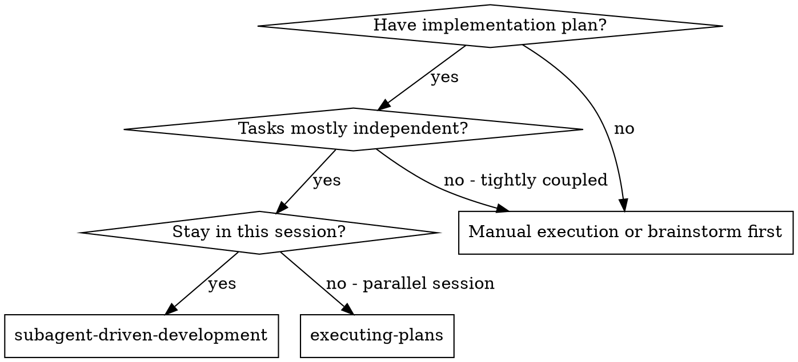
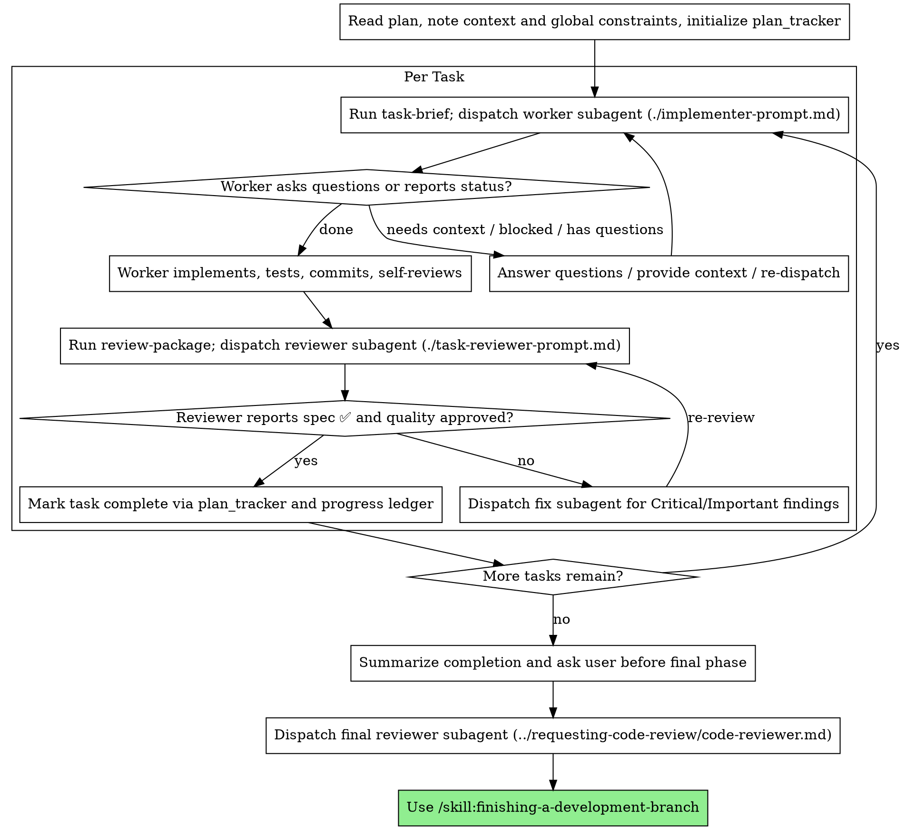

# Subagent-Driven Development

Execute a plan by dispatching a fresh worker subagent per task, a task review (spec compliance + code quality) after each, and a broad whole-branch review at the end.

**Why subagents:** You delegate tasks to specialized agents with isolated context. By precisely crafting their instructions and context, you keep them focused and effective. They should never inherit your full session history — you construct exactly what they need. This preserves your own context for orchestration and review.

**Core principle:** Fresh subagent per task + task review (spec + quality) + broad final review = high quality, fast iteration.

**Narration:** between tool calls, narrate at most one short line — the ledger and the tool results carry the record.

**Continuous execution:** Do not pause to check in with your human partner between tasks. Execute all tasks from the plan without stopping. The only reasons to stop are: BLOCKED status you cannot resolve, ambiguity that genuinely prevents progress, or all tasks complete. "Should I continue?" prompts and progress summaries waste their time — they asked you to execute the plan, so execute it.

If a tool result contains a ⚠️ workflow warning, stop immediately and address it before continuing.

## Prerequisites
- Active branch (not main/master) or user-confirmed intent to work on main
- Approved plan or clear task scope
- Ability to dispatch the required subagents

## When to Use


```dot
digraph when_to_use {
    "Have implementation plan?" [shape=diamond];
    "Tasks mostly independent?" [shape=diamond];
    "Stay in this session?" [shape=diamond];
    "subagent-driven-development" [shape=box];
    "executing-plans" [shape=box];
    "Manual execution or brainstorm first" [shape=box];

    "Have implementation plan?" -> "Tasks mostly independent?" [label="yes"];
    "Have implementation plan?" -> "Manual execution or brainstorm first" [label="no"];
    "Tasks mostly independent?" -> "Stay in this session?" [label="yes"];
    "Tasks mostly independent?" -> "Manual execution or brainstorm first" [label="no - tightly coupled"];
    "Stay in this session?" -> "subagent-driven-development" [label="yes"];
    "Stay in this session?" -> "executing-plans" [label="no - parallel session"];
}
```

**Use this when:**
- you already have a written implementation plan
- tasks are mostly independent or only moderately coupled
- you want to stay in the current session
- you want review after each task without stopping for a human checkpoint every time

**Prefer `/skill:executing-plans` when:**
- tasks are tightly coupled
- you want stronger human review between batches
- the work needs more in-session orchestration than isolated execution

**Dependent tasks:** Most real plans have some dependencies. For dependent tasks, include the previous task's interfaces and important decisions in the next dispatch — the Interfaces block in each task brief carries the exact signatures.

## The Process


```dot
digraph process {
    rankdir=TB;

    subgraph cluster_per_task {
        label="Per Task";
        "Run task-brief; dispatch worker subagent (./implementer-prompt.md)" [shape=box];
        "Worker asks questions or reports status?" [shape=diamond];
        "Answer questions / provide context / re-dispatch" [shape=box];
        "Worker implements, tests, commits, self-reviews" [shape=box];
        "Run review-package; dispatch reviewer subagent (./task-reviewer-prompt.md)" [shape=box];
        "Reviewer reports spec ✅ and quality approved?" [shape=diamond];
        "Dispatch fix subagent for Critical/Important findings" [shape=box];
        "Mark task complete via plan_tracker and progress ledger" [shape=box];
    }

    "Read plan, note context and global constraints, initialize plan_tracker" [shape=box];
    "More tasks remain?" [shape=diamond];
    "Summarize completion and ask user before final phase" [shape=box];
    "Dispatch final reviewer subagent (../requesting-code-review/code-reviewer.md)" [shape=box];
    "Use /skill:finishing-a-development-branch" [shape=box style=filled fillcolor=lightgreen];

    "Read plan, note context and global constraints, initialize plan_tracker" -> "Run task-brief; dispatch worker subagent (./implementer-prompt.md)";
    "Run task-brief; dispatch worker subagent (./implementer-prompt.md)" -> "Worker asks questions or reports status?";
    "Worker asks questions or reports status?" -> "Answer questions / provide context / re-dispatch" [label="needs context / blocked / has questions"];
    "Answer questions / provide context / re-dispatch" -> "Run task-brief; dispatch worker subagent (./implementer-prompt.md)";
    "Worker asks questions or reports status?" -> "Worker implements, tests, commits, self-reviews" [label="done"];
    "Worker implements, tests, commits, self-reviews" -> "Run review-package; dispatch reviewer subagent (./task-reviewer-prompt.md)";
    "Run review-package; dispatch reviewer subagent (./task-reviewer-prompt.md)" -> "Reviewer reports spec ✅ and quality approved?";
    "Reviewer reports spec ✅ and quality approved?" -> "Dispatch fix subagent for Critical/Important findings" [label="no"];
    "Dispatch fix subagent for Critical/Important findings" -> "Run review-package; dispatch reviewer subagent (./task-reviewer-prompt.md)" [label="re-review"];
    "Reviewer reports spec ✅ and quality approved?" -> "Mark task complete via plan_tracker and progress ledger" [label="yes"];
    "Mark task complete via plan_tracker and progress ledger" -> "More tasks remain?";
    "More tasks remain?" -> "Run task-brief; dispatch worker subagent (./implementer-prompt.md)" [label="yes"];
    "More tasks remain?" -> "Summarize completion and ask user before final phase" [label="no"];
    "Summarize completion and ask user before final phase" -> "Dispatch final reviewer subagent (../requesting-code-review/code-reviewer.md)";
    "Dispatch final reviewer subagent (../requesting-code-review/code-reviewer.md)" -> "Use /skill:finishing-a-development-branch";
}
```

## Pre-Flight Plan Review

Before dispatching Task 1, scan the plan once for conflicts:

- tasks that contradict each other or the plan's Global Constraints
- anything the plan explicitly mandates that the review rubric treats as a defect (a test that asserts nothing, verbatim duplication of a logic block)

Present everything you find to your human partner as one batched question — each finding beside the plan text that mandates it, asking which governs — before execution begins, not one interrupt per discovery mid-plan. If the scan is clean, proceed without comment. The review loop remains the net for conflicts that only emerge from implementation.

## Model Selection

Use the least powerful model that can handle each role to conserve cost and increase speed.

**Mechanical implementation tasks** (isolated functions, clear specs, 1-2 files): use a fast, cheap model. Most implementation tasks are mechanical when the plan is well-specified.

**Integration and judgment tasks** (multi-file coordination, pattern matching, debugging): use a standard model.

**Architecture and design tasks**: use the most capable available model. The final whole-branch review is one of these — dispatch it on the most capable available model, not the session default.

**Review tasks**: choose the model with the same judgment, scaled to the diff's size, complexity, and risk. A small mechanical diff does not need the most capable model; a subtle concurrency change does.

**Always specify the model explicitly when dispatching a subagent.** Pass `model` in the `subagent` call. An omitted model falls back to the agent definition's default — which silently defeats this section.

**Turn count beats token price.** Wall-clock and context cost scale with how many turns a subagent takes, and the cheapest models routinely take 2-3× the turns on multi-step work — costing more overall. Use a mid-tier model as the floor for reviewers and for workers implementing from prose descriptions. When the task's plan text contains the complete code to write, the implementation is transcription plus testing: use the cheapest tier for that worker. Single-file mechanical fixes also take the cheapest tier.

**Task complexity signals (implementation tasks):**
- Touches 1-2 files with a complete spec → cheap model
- Touches multiple files with integration concerns → standard model
- Requires design judgment or broad codebase understanding → most capable model

## Handling Worker Status

Worker subagents report one of four statuses. Handle each appropriately:

**DONE:** Generate the review package (`scripts/review-package BASE HEAD`, from this skill's directory — it prints the unique file path it wrote; BASE is the commit you recorded before dispatching the worker — never `HEAD~1`, which silently drops all but the last commit of a multi-commit task), then dispatch the reviewer with the printed path.

**DONE_WITH_CONCERNS:** The worker completed the work but flagged doubts. Read the concerns before proceeding. If the concerns are about correctness or scope, address them before review. If they're observations (e.g., "this file is getting large"), note them and proceed to review.

**NEEDS_CONTEXT:** The worker needs information that wasn't provided. Provide the missing context and re-dispatch.

**BLOCKED:** The worker cannot complete the task. Assess the blocker:
1. If it's a context problem, provide more context and re-dispatch with the same model
2. If the task requires more reasoning, re-dispatch with a more capable model
3. If the task is too large, break it into smaller pieces
4. If the plan itself is wrong, escalate to the human

**Never** ignore an escalation or force the same model to retry without changes. If the worker said it's stuck, something needs to change.

## Handling Reviewer ⚠️ Items

The task reviewer may report "⚠️ Cannot verify from diff" items — requirements that live in unchanged code or span tasks. These do not block the rest of the review, but you must resolve each one yourself before marking the task complete: you hold the plan and cross-task context the reviewer lacks. If you confirm an item is a real gap, treat it as a failed spec review — send it back to a fix subagent and re-review.

## Constructing Reviewer Prompts

Per-task reviews are task-scoped gates. The broad review happens once, at the final whole-branch review. When you fill a reviewer template:

- Do not add open-ended directives like "check all uses" or "run race tests if useful" without a concrete, task-specific reason
- Do not ask a reviewer to re-run tests the worker already ran on the same code — the worker's report carries the test evidence
- Do not pre-judge findings for the reviewer — never instruct a reviewer to ignore or not flag a specific issue. If you believe a finding would be a false positive, let the reviewer raise it and adjudicate it in the review loop. If the prompt you are writing contains "do not flag," "don't treat X as a defect," "at most Minor," or "the plan chose" — stop: you are pre-judging, usually to spare yourself a review loop.
- The global-constraints block you hand the reviewer is its attention lens. Copy the binding requirements verbatim from the plan's Global Constraints section or the spec: exact values, exact formats, and the stated relationships between components ("same layout as X", "matches Y"). The reviewer's template already carries the process rules (YAGNI, test hygiene, review method) — the constraints block is for what THIS project's spec demands.
- Hand the reviewer its diff as a file: run this skill's `scripts/review-package BASE HEAD` and pass the reviewer the file path it prints (or, without bash: `git log --oneline`, `git diff --stat`, and `git diff -U10` for the range, redirected to one uniquely named file). The output never enters your own context, and the reviewer sees the commit list, stat summary, and full diff with context in one Read call. Use the BASE you recorded before dispatching the worker — never `HEAD~1`, which silently truncates multi-commit tasks.
- A dispatch prompt describes one task, not the session's history. Do not paste accumulated prior-task summaries ("state after Tasks 1-3") into later dispatches — a real session's dispatch hit 42k chars of which 99% was pasted history. A fresh subagent needs its task, the interfaces it touches, and the global constraints. Nothing else.
- Dispatch fix subagents for Critical and Important findings. Record Minor findings in the progress ledger as you go, and point the final whole-branch review at that list so it can triage which must be fixed before merge. A roll-up nobody reads is a silent discard.
- A finding labeled plan-mandated — or any finding that conflicts with what the plan's text requires — is the human's decision, like any plan contradiction: present the finding and the plan text, ask which governs. Do not dismiss the finding because the plan mandates it, and do not dispatch a fix that contradicts the plan without asking.
- The final whole-branch review gets a package too: run `scripts/review-package MERGE_BASE HEAD` (MERGE_BASE = the commit the branch started from, e.g. `git merge-base main HEAD`) and include the printed path in the final review dispatch, so the final reviewer reads one file instead of re-deriving the branch diff with git commands.
- Every fix dispatch carries the worker contract: the fix subagent re-runs the tests covering its change and reports the results. Name the covering test files in the dispatch — a one-line fix does not need the whole suite. Before re-dispatching the reviewer, confirm the fix report contains the covering tests, the command run, and the output; dispatch the re-review once all three are present.
- If the final whole-branch review returns findings, dispatch ONE fix subagent with the complete findings list — not one fixer per finding. Per-finding fixers each rebuild context and re-run suites; a real session's final-review fix wave cost more than all its tasks combined.

## File Handoffs

Everything you paste into a dispatch prompt — and everything a subagent prints back — stays resident in your context for the rest of the session and is re-read on every later turn. Hand artifacts over as files:

- **Task brief:** before dispatching a worker, run this skill's `scripts/task-brief PLAN_FILE N` — it extracts the task's full text to a uniquely named file and prints the path. Compose the dispatch so the brief stays the single source of requirements. Your dispatch should contain: (1) one line on where this task fits in the project; (2) the brief path, introduced as "read this first — it is your requirements, with the exact values to use verbatim"; (3) interfaces and decisions from earlier tasks that the brief cannot know; (4) your resolution of any ambiguity you noticed in the brief; (5) the report-file path and report contract. Exact values (numbers, magic strings, signatures, test cases) appear only in the brief.
- **Report file:** name the worker's report file after the brief (brief `…/task-N-brief.md` → report `…/task-N-report.md`) and put it in the dispatch prompt. The worker writes the full report there and returns only status, commits, a one-line test summary, and concerns.
- **Reviewer inputs:** the task reviewer gets three paths — the same brief file, the report file, and the review package — plus the global constraints that bind the task.
- Fix dispatches append their fix report (with test results) to the same report file and return a short summary; re-reviews read the updated file.

## Durable Progress

Conversation memory does not survive compaction. In real sessions, controllers that lost their place have re-dispatched entire completed task sequences — the single most expensive failure observed. Track progress in a ledger file alongside `plan_tracker` — the tracker is your live task list; the ledger is the compaction-proof record.

- At skill start, check for a ledger: `cat "$(git rev-parse --show-toplevel)/.superpowers/sdd/progress.md"`. Tasks listed there as complete are DONE — do not re-dispatch them; resume at the first task not marked complete.
- When a task's review comes back clean, append one line to the ledger in the same message as your other bookkeeping: `Task N: complete (commits <base7>..<head7>, review clean)`.
- The ledger is your recovery map: the commits it names exist in git even when your context no longer remembers creating them. After compaction, trust the ledger and `git log` over your own recollection.
- `git clean -fdx` will destroy the ledger (it's git-ignored scratch); if that happens, recover from `git log`.

## Prompt Templates

Use the templates in this directory:
- [implementer-prompt.md](implementer-prompt.md) — dispatch `worker` subagent for implementation
- [task-reviewer-prompt.md](task-reviewer-prompt.md) — dispatch `reviewer` subagent for the task review (spec compliance + code quality)
- Final whole-branch review: use `/skill:requesting-code-review`'s [code-reviewer.md](../requesting-code-review/code-reviewer.md) with the `reviewer` subagent

**How to dispatch:**

Use the `subagent` tool directly with filled prompt text, always passing an explicit `model`:

```ts
subagent({ agent: "worker", model: "<per Model Selection>", task: "... filled implementer prompt ..." })
```

```ts
subagent({ agent: "reviewer", model: "<per Model Selection>", task: "... filled task-reviewer prompt ..." })
```

## Orchestrator Rules

- Read the plan once, note global constraints, and initialize `plan_tracker` with the full task list before starting
- Record the current commit as BASE before each worker dispatch
- Extract each task's brief with `scripts/task-brief` — do not paste task text or make subagents read the entire plan file
- Track interfaces from completed tasks so later dispatches receive the right context
- Do not skip the task review, and do not accept a report missing either verdict (spec compliance AND task quality are both required)
- Do not move to the next task while Critical/Important findings remain open

## Example Workflow

```
You: I'm using Subagent-Driven Development to execute this plan.

[Read plan file once: docs/plans/feature-plan.md]
[Initialize plan_tracker with all 5 tasks; note Global Constraints]
[Check ledger: .superpowers/sdd/progress.md — empty, starting fresh]

Task 1: Hook installation script

[Record BASE; run scripts/task-brief docs/plans/feature-plan.md 1]
[Dispatch `worker` with brief path + report path + context]

Worker: "Before I begin - should the hook be installed at user or system level?"

You: "User level (~/.config/superpowers/hooks/)"

Worker: "Got it. Implementing now..."
[Later] Worker:
  - Status: DONE
  - Commits: abc1234 feat: install-hook command
  - Tests: 5/5 passing, output pristine
  - Report: .superpowers/sdd/task-1-report.md

[Run scripts/review-package BASE HEAD]
[Dispatch `reviewer` with brief + report + package paths + global constraints]
Reviewer: Spec ✅ - all requirements met, nothing extra.
  Strengths: Good test coverage, clean. Issues: None. Task quality: Approved.

[Mark Task 1 complete in plan_tracker; append to ledger]

Task 2: Recovery modes

[Record BASE; run task-brief for Task 2]
[Dispatch `worker` with brief + report paths + Task 1 interfaces]

Worker: [No questions, proceeds]
Worker:
  - Status: DONE
  - Commits: def5678 feat: verify/repair modes
  - Tests: 8/8 passing

[Run review-package; dispatch `reviewer`]
Reviewer: Spec ❌:
  - Missing: Progress reporting (spec says "report every 100 items")
  - Extra: Added --json flag (not requested)
  Issues (Important): Magic number (100)

[Dispatch fix subagent with all findings + covering test files]
Fixer: Removed --json flag, added progress reporting, extracted
  PROGRESS_INTERVAL constant. Covering tests re-run: 9/9 passing.

[Run review-package for the new range; dispatch `reviewer` again]
Reviewer: Spec ✅. Task quality: Approved.

[Mark Task 2 complete in plan_tracker; append to ledger]

...

[After all tasks]
You: "All 5 tasks complete and reviewed. Ready for final review and finishing?"
User: "Yes"

[Run scripts/review-package $(git merge-base main HEAD) HEAD]
[Dispatch final `reviewer` on the most capable model with the package path
 + the ledger's Minor-findings list]
Final reviewer: All requirements met, ready to merge

Done!
```

## Red Flags

**Never:**
- Start implementation on main/master branch without explicit user consent
- Skip the task review, or accept a report missing either verdict (spec compliance AND task quality are both required)
- Proceed with unfixed issues
- Dispatch multiple implementation subagents in parallel against the same changing codebase
- Make a subagent read the whole plan file (hand it its task brief — `scripts/task-brief` — instead)
- Skip scene-setting context (the worker needs to understand where the task fits)
- Ignore subagent questions (answer before letting them proceed)
- Accept "close enough" on spec compliance (reviewer found spec issues = not done)
- Skip review loops (reviewer found issues = fix subagent = review again)
- Let worker self-review replace actual review (both are needed)
- Tell a reviewer what not to flag, or pre-rate a finding's severity in the dispatch prompt ("treat it as Minor at most") — the plan's example code is a starting point, not evidence that its weaknesses were chosen
- Dispatch a task reviewer without a diff file — generate it first (`scripts/review-package BASE HEAD`) and name the printed path in the prompt
- Move to next task while the review has open Critical/Important issues
- Re-dispatch a task the progress ledger already marks complete — check the ledger (and `git log`) after any compaction or resume
- Write code yourself to rescue a failed worker task unless the workflow has explicitly changed

**If a subagent asks questions:**
- Answer clearly and completely
- Provide additional context if needed
- Don't rush them into implementation

**If the reviewer finds issues:**
- Dispatch a fix subagent with the complete findings list
- Re-review after fixes (fresh review package for the new range)
- Repeat until approved
- Don't skip the re-review

## When a Subagent Fails

You are the orchestrator. You do NOT write code as a shortcut around the process.

If a worker subagent fails, errors out, or produces incomplete work:

1. **Attempt 1:** Dispatch a NEW fix subagent with specific instructions about what went wrong. Include the task brief path and the error output.
2. **Attempt 2:** If that also fails, dispatch one more with a changed approach, more context, or a stronger model.
3. **After 2 failed attempts:** STOP. Report the failure to the user and ask how to proceed. The task likely needs redesign or replanning.

**Never:**
- patch the work inline "just to finish it"
- silently skip the failed task
- reduce quality gates because the task is almost done

## After All Tasks Complete

When all tasks are done and reviewed:

1. Summarize what was implemented
   - tasks completed
   - important files changed
   - tests run / counts if available
2. Ask: **"All tasks complete. Ready for final review and finishing?"**
3. Wait for user confirmation before proceeding

Then dispatch the final whole-branch review (most capable model, review package for `MERGE_BASE..HEAD`, ledger's Minor-findings list) and, once clean, use `/skill:finishing-a-development-branch`.

## Integration

**Required workflow skills:**
- **`/skill:using-git-worktrees`** — Recommended: set up isolated workspace before starting. For small changes, branching in the current directory is acceptable with user approval.
- **`/skill:writing-plans`** — Creates the plan this skill executes; its Global Constraints section and per-task Interfaces blocks feed the dispatches
- **`/skill:requesting-code-review`** — Final whole-branch review template and review expectations
- **`/skill:finishing-a-development-branch`** — Complete development after the final review

**Subagents follow by default:**
- **TDD** — Runtime warnings on source-before-test patterns. Worker subagents used for implementation receive three-scenario TDD instructions via agent profiles and prompt templates: new feature (full TDD), modifying tested code (run existing tests), trivial change (judgment call).

**Alternative workflow:**
- **`/skill:executing-plans`** — Use for a parallel session instead of same-session orchestration
